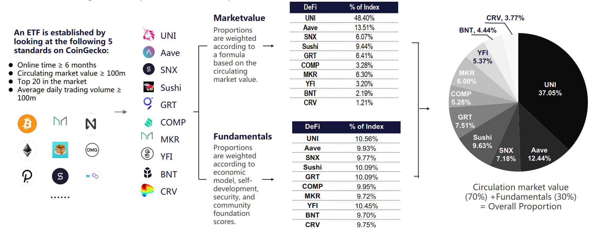

# Matrix DeFi Index Set\(MDI\)

Matrix DeFI Index\(MDI\) is a kind of capitalization-weighted index fund, which is composed of the best DeFi protocols in the cryptocurrency market \(including UNI, SUSHI, AAVE, SNX, MKR, COMP,YFI, CRV, GRT, etc.\), and can track popular DeFi assets in the whole cryptocurrency market.

MDI issues shares according to market share and real capitals, which means that each MDI share is supported by the underlying encrypted assets and can be subscribed and redeemed at any time.

In the traditional financial world, ETFs or index funds provide more freedom and choice for ordinary investors. We believe that in the cryptocurrency market, MDI allows a greater diversification of risk and gains the better returns through diversified asset allocation of DeFi.

For new investors, MDI provides a perfect introduction and investment opportunity to DeFi if they are lack of understanding of the market volatility and numerous DeFi projects.

Meanwhile, by subscribing MDI, users can greatly save the gas fee of Ethereum and other public chains, and only pay once to gain encrypted assets including multiple tokens.

## Subscription

There are many ways to subscribe MDI fund, investors can free to choose:

* Uniswap, Sushiswap and other DEX
* MatrixSwap Platform
* The MINT function of MatrixSwap Platform

## **Insurance**

The fund issuance on MatrixETF platform is mainly through MINT components. Generally, there are three ways to issue MDI:

1. Transfer to ETH, USDT and other basic assets to mint in exchange for MDI fund shares;
2. According to the ratio of MDI fund composition, a basket of DeFi tokens is provided to mint MDI fund shares;
3. A single DeFi asset is minted in exchange for MDI fund shares

## **MDI Fund Asset Ratio:**

MDI fund is composed of hot DeFi projects in cryptocurrency market, including UNI, SUSHI, AAVE, SNX, MKR, COMP, YFI, BNT, CRV, GRT, etc.

MatrixETF adopts the fundamental weighted method, which is weighted by 70% of the circulation market value and 30% of the fundamentals.

The price and circulating supply of each token are obtained through CoinGecko and CoinMarketCap, and the circulation market value is determined by multiplying the price of each token by the circulating supply. 

When considering the fundamentals, it will be analyzed from the economic model of the token, the development of the project, the security of the agreement, the transaction risk of the token, and the community foundation \(please see the "Standards of an ETF" below\).

The figure below is an illustration of MDI:

The index will be re**-**weighted on the first day of each month. When the market value of MDI fund exceeds $10M, the number and proportion of tokens corresponding to each MDI fund will be updated simultaneously.

\*\*\*\*

