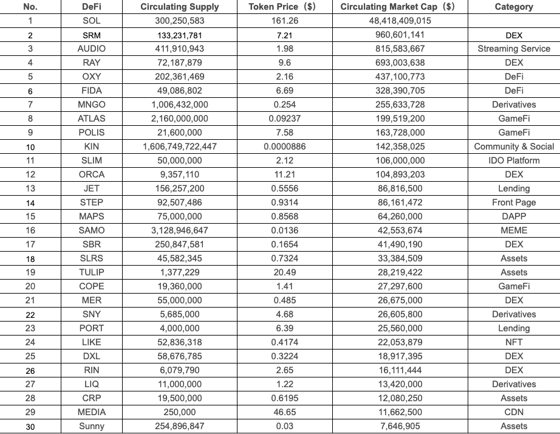

# Matrix Solana Index（MSI）

## Introduction of Matrix Solana Index 

Matrix Solana Index(MSI) is a first index to track the top presentation in Solana ecosystem, which provides investors with an investment and autonomous portfolio which is based on Solana ecosystem and decentralized governance. By holding MSI you can easily participate in investing in the Solana project, realize diversified asset placements and enjoy the prosperity of the Solana dynamic ecosystem.

When we designed Matrix Solana Index, we referred to the project classification of CoinGecko and CoinMarketCap to Solana Ecosystem, then filtered the top and potential asset from it.

\
By comprehensive consideration of market trend, project market cap comparison, project developing status, the place in the market and technology（ limits on Solana transaction sizes), we have chosen 8 protocols of SOL. SRM. RAY. FIDA. MNGO. ATLAS. SLIM. TULIP to constitute MSI, in order to track the market presentation and developing trend of Solana ecosystem.

The other tokens are as backup tokens such as AUDIO. OXY. KIN. ORCA. STEP. COPE. PORT. Sunny etc,. Once one performs better than the initial 8 kinds of MSI component tokens, it will replace the old one to get into the index pool and be realized by Index rebalance.

## MSI Weighting Proportion 

MSI is constituted by 8 popular projects of Solana blockchain such as SOL. SRM. RAY. FIDA. MNGO. ATLAS. SLIM. TULIP.

MSI is a first index product focusing on Solana ecosystem, all belonged projects are high qualified projects in Solana ecosystem with their own tokens, own protocols and corresponding eco functions:

1. SOL: a decentralized blockchain built to enable scalable, user-friendly apps for the world.
2. SRM:​​ a protocol for decentralized exchanges.
3. RAY: on-chain order book automated market maker (AMM) , TVL: $1.77 Billions.
4. FIDA: on-chain Perpetual swaps, DEX, Name service, Bots.
5. MNGO: leveraged trading platform, including Spot Margin, Perpetual Futures, Borrow & Lend, etc.
6. ATLAS: A grand strategy game of space exploration, territorial conquest, political domination, and more.
7. SLIM: Solana’s IDO & Staking platform.
8. TULIP: Solana’s Yield Aggregation Homestead, Total Value Locked:$0.794 Billion.

When calculating different MSI component token weighting proportions, we utilize 30% Fundamental Weighting+70% Market Capitalization Square Root Weighting to compute each basic asset allocation and weighting proportion. (For detailed method please refer to[《MatrixETF Index Methodology》](https://matrixetf.medium.com/matrixetf-index-methodology-d80e1f4860e8)）

## Fundamental Weighting 

According to MatrixETF Index Methodology, there are 5 standards to filter in Fundamental Weighting:

* Token Economic Model
* Project development
* Security of protocol
* Token trade risk
* Community base

According to 5 features of Fundamental Weighting, we compute MSI component token weighting proportions as below:

## Market Capitalization Square Root Weighting 

Market Capitalization refers to the project circulation market capitalization, according to the authoritative data of CoinGecko and Coinmarketcap, to compute circulation market capitalization by obtaining Token prices and circulation data. There are 3 market wide accepted methods to weight the project market capitalization: Market Capitalization Weighting, Market Value Square Root Weighting and Equal Weighting.

According to Market Capitalization Weighting, we compute MSI component token weighting proportions as below:

Market Capitalization of SOL (94.80%) is higher than the biggest asset proportion（Max ≤ 80%）, this is why we chose Market Capitalization Square Root Weighting to restrain one asset impact to portfolio. We compute MSI component token proportions as below:

## Final Weighting Proportion 

According to the weight method of 70% Market Capitalization+30% Fundamental Weighting, we comprehensively compute MSI component token final proportions as below:

\

## &#x20;
