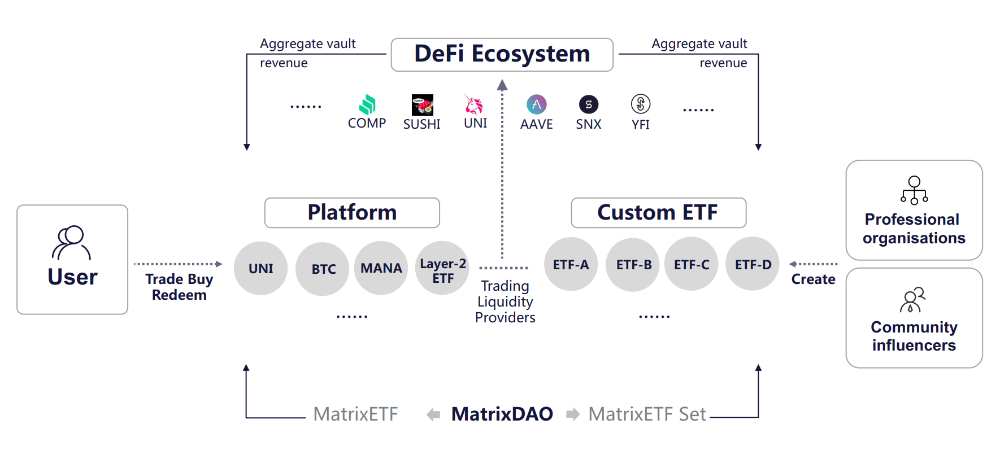

# The Logical Design of MatrixETF

MatrixETF is the next generation of decentralized ETF platform supporting cross chain. According to the overall performance of cryptocurrency market, MatrixETF will launch a series of conceptual ETFs to track the quality tokens in blockchain industry and DeFi.

The Logical Design of MatrixETF, as shown in the following figure:

MatrixETF platform is managed by MatrixDao, which is a decentralized community autonomous organization. MatrixDao launched several lead conceptual ETF funds as the foundation of platform startup, and then gradually transited to community autonomy to jointly determine the construction and implementation of ETF products. The ultimate goal is to let community members make their decisions independently of the development and future direction of the platform.

MatrixETF Set is an ETF-DeFi protocol, which can provide investment portfolio and trading services for asset issuers/KOL, asset managers and individuals. Through this agreement, any user can create an ETF of cryptocurrency, receive capital injection from other users, and participate in the DeFi to generate returns.

Meanwhile, most ETF products on MatrixETF are supported by a basket of encrypted assets, which can be subscribed and redeemed at any time. These encrypted assets will participate in the interaction based on the DeFi ecology, such as Compound lending, Uniswap liquidity mining, etc., and generate Vault returns, which will be returned to the users holding ETF products and bring additional income to them.

