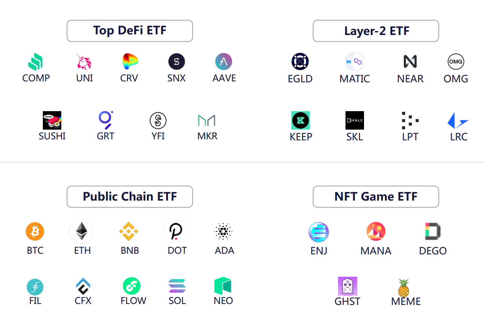

# Matrix Index

Matrix Index is a cryptocurrency index fund designed to track quality tokens in blockchain industry and DeFi finance. The index fund is weighted based on the market value of each token. There is a basket of token assets of the fund. The fund share can be subscribed and sold on MatrixETF platform. It can also be used to mint new fund share through a basket of tokens and redeem them.

Matrix index is the simplest way to participate in the DeFi finance, because users do not need to buy these DeFi tokens from exchanges. The index will be evaluated and adjusted once a month to weaken or eliminate the poorly performing tokens, add the weighted tokens with high quality, or add new DeFi tokens for balance, so as to reflect the overall trend of the cryptocurrency market as much as possible.

Meanwhile, by subscribing MDI product, users can greatly save the gas fee of Ethereum and other public chains, and only pay once to gain encrypted assets including multiple tokens.

## Types of Matrix Index Funds

They include the following types of index:

* DeFI leading ETF fund: MDI, tracking tokens in DeFi.
* Public chain index fund: MCI, tracking public chain ecological development in cryptocurrency market.
* Solana ecological ETF fund: MSI, tracking hot projects and potential projects in Solana public chain ecology.
* Stable coins fund: to balance the exposure of various stable coins, the main goal is to act as the stable coin and object of value measurement in MatrixETF ecology.
* NFT fund products: track the crypto games and NFT.

At the same time, we will add and delete the index funds according to the development of the blockchain industry and the opinions and proposals of community users. If you have good suggestions or proposals, please contact us. If your proposal is accepted, you will receive MDF bonuses.

## MatrixETF Index Fund Standards

MatrixETF adopts the fundamental weighted method, which is weighted by 70% of the circulating market value and 30% of the fundamentals.

### Circulation Market Value

In terms of circulation market value, the price and circulating supply of each token are obtained through CoinGecko and Coinmarketcap, and the circulation market value is determined by multiplying the price of each token by the circulating supply.&#x20;

The following table is an example of the market value ratio of MDI funds:

| DeFi  | Circulating Supply | Token Price（$） | Circulating Market Cap（$） | % of Index |
| ----- | ------------------ | -------------- | ------------------------- | ---------- |
| UNI   | 519,857,388        | 31.16          | 16,197,040,681            | 48%        |
| Aave  | 12,275,357         | 368.30         | 4,521,013,983             | 14%        |
| SNX   | 106,061,984        | 19.14          | 2,029,686,975             | 6%         |
| Sushi | 156,541,312        | 20.18          | 3,159,128,909             | 9%         |
| GRT   | 1,245,666,867      | 1.72           | 2,144,290,945             | 6%         |
| COMP  | 2,561,279          | 427.93         | 1,096,048,122             | 3%         |
| MKR   | 996,553            | 2114.54        | 2,107,251,181             | 6%         |
| YFI   | 30,000             | 35657.25       | 1,069,717,500             | 3%         |
| BNT   | 94,552,997         | 7.75           | 732350783.00              | 2%         |
| CRV   | 200,408,156        | 2.03           | 406,267,414               | 1%         |
| Total |                    |                | 33462796493.00            | 100%       |

### Fundamentals Value

When considering the fundamentals, it will be analyzed from the economic model of the token, the development of the project, the security of the agreement, the transaction risk of the token, and the community foundation, these five standards will be used to screen the projects to be selected into the funds.

#### Economic Model of Token

* The token must have a detailed allocation model
* The release of initial circulation and supply of token is reasonable
* The token must have practical use and intrinsic value
* Whether the number and distribution of token holders are appropriate or not, there is no risk of forced manipulation

#### Development of  the Project

* The project must be in the construction of useful agreements or products, not with the nature of Ponzi scheme, or entertainment gambling purposes.
* Whether the project has a clear roadmap and is implemented as planned.
* The project must have GitHub code, and submit it regularly.
* The project must have a product (beta version or official version), or a relatively complete product design.
* The agreement or product must have been released for at least 90 days.
* The ecology and application development of the project.
* The status of the agreement or project cannot be bankruptcy.

#### Security of Protocol

* Whether the project has been audited by professional staff or well-known audit institutions to determine the security of smart contract and whether it can maintain the security of user assets.
* The number of days of smart contract/code operation and the number of transactions on the chain to reflect the level of smart contract.
* Whether the project has complete documents and risk mechanism plan. In case of safety accidents, the team must respond quickly to provide reliable solutions for the users and avoid property losses.
* The token must have sufficient liquidity on various trading platforms.

#### Trading Risks

* If the market value of token is too small, it is easy to cause strong fluctuation of token price and the risk of manipulation.
* The volatility risk of token price is relative to the volatility of BTC/ETH.
* Whether it can be smoothly traded, whether it is listed on the leading exchanges, whether it has futures, options and other derivatives.
* Whether the liquidity, daily average trading volume and turnover rate of token are normal.
* The number and distribution of token holders.

#### Project Community

* The project must have a more standardized community governance process
* Whether the project has established an international community (Twitter/telegram/facebook/Meduim/Discord, etc.)
* Data on the number of users, participation and daily user activity of the project community
* Whether the project has weekly journals, regularly release project progress, and actively communicate with community users.

The table below is an example of the proportion of fundamentals of MDI funds:

| **DeFi** | Economic Model | Development | Security | Trading Risk | Community Foundation | Average |  **%of Index** |
| -------- | -------------- | ----------- | -------- | ------------ | -------------------- | ------- | -------------- |
| UNI      | 8.5            | 9.5         | 9.0      | 9.5          | 9.8                  | 9.26    | 10.66%         |
| Aave     | 8.0            | 9.0         | 8.8      | 9.3          | 8.8                  | 8.78    | 10.10%         |
| SNX      | 8.2            | 8.6         | 8.5      | 9.0          | 8.5                  | 8.56    | 9.85%          |
| Sushi    | 9.0            | 8.5         | 8.6      | 8.2          | 9.4                  | 8.74    | 10.06%         |
| GRT      | 8.6            | 9.0         | 9.0      | 8.0          | 8.5                  | 8.62    | 9.92%          |
| COMP     | 9.0            | 8.8         | 8.4      | 8.8          | 8.6                  | 8.72    | 10.03%         |
| MKR      | 8.4            | 9.0         | 8.3      | 8.6          | 8.0                  | 8.46    | 9.74%          |
| YFI      | 9.6            | 9.0         | 8.8      | 8.7          | 8.8                  | 8.98    | 10.33%         |
| BNT      | 8.8            | 8.6         | 8.6      | 7.8          | 8.0                  | 8.36    | 9.62%          |
| CRV      | 9.2            | 8.5         | 8.5      | 8.1          | 7.8                  | 8.42    | 9.69%          |
| Total    |                |             |          |              |                      | 86.9    | 100.00%        |

The following table is an example of the final proportion after taking the market value and fundamentals into consideration:

| DeFi  | Market Cap(70%) | Fundamental(30%) | Average | % of Index |
| ----- | --------------- | ---------------- | ------- | ---------- |
| UNI   | 48.40           | 10.66            | 59.06   | 29.53%     |
| Aave  | 13.51           | 10.10            | 23.61   | 11.81%     |
| SNX   | 6.07            | 9.85             | 15.92   | 7.96%      |
| Sushi | 9.44            | 10.06            | 19.50   | 9.75%      |
| GRT   | 6.41            | 9.92             | 16.33   | 8.16%      |
| COMP  | 3.28            | 10.03            | 13.31   | 6.65%      |
| MKR   | 6.30            | 9.74             | 16.03   | 8.02%      |
| YFI   | 3.20            | 10.33            | 13.53   | 6.77%      |
| BNT   | 2.19            | 9.62             | 11.81   | 5.90%      |
| CRV   | 1.21            | 9.69             | 10.90   | 5.45%      |
| Total | 100.00          | 100.00           | 200.00  | 100.00%    |

### Matrix Index Rebalance

According to the development of the cryptocurrency market and the operation status of the project party, Matrix Index will be maintained and adjusted on a monthly basis, including the weighted proportion of tokens, addition and deletion of new tokens, etc.

The process of Rebalance consists of two phases:

#### 1.Confirmation:

This phase usually takes place in the fourth week of each month. At this phase, the details of the next reorganization will be discussed and determined, including:

* Whether to adjust circulating supply of funds
* Whether to adjust the token weighted proportion
* Whether to delete tokens or add new tokens
* Details of new tokens

#### 2.Rebalance

The index and fund need to be adjusted according to the announcement after the end of the confirmation, in which the addition and deletion of related token and weighted proportion are completed in the first week of the next month.
