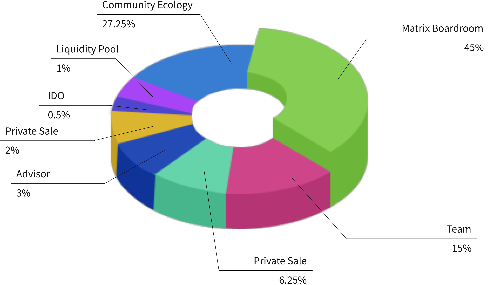

# MDF Allocation

MDF is a token deployed on Ethereum and Solana blockchain network, and its maximum supply limit is 1,000,000,000 tokens.

MDF allocation includes the following parts:

* IDO \(0.5%\): initial issue in IDO.
* PE \(6.25%\): Unlock 10% before listing, and the remaining will be unlocked once a quarter, which will be completed within 1 year.
* PE+ \(2%\): Unlock 15% before listing, and the remaining will be unlocked once a quarter, which will be completed within 9 months.
* Team \(15%\): 20% will be unlocked after 6 months of listing, and the remaining 80% will be unlocked linearly over the next 24 months.
* Consultant \(3%\): 20% will be unlocked after 6 months of listing, and the remaining 80% will be unlocked linearly over the next 24 months.
* Liquidity pool \(1%\): to create DEX liquidity pool.
* Community ecology and operation \(27.25%\): including air-drop, community promotion, various activities or proposal awards, 6% of which are unlocked immediately after the listing, and 94% will be unlocked linearly in 4 years.
* Matrix Vault \(45%\): the attribution and application scenarios will be voted by Matrix DAO community, and unlocked within 4 years, including staking and liquidity mining rewards, ETF incentives, community activities, etc.

