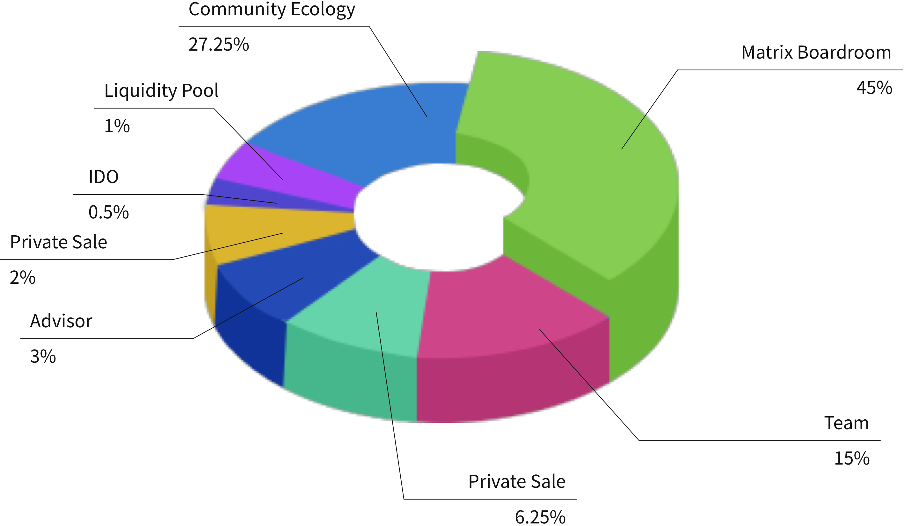

# MDF Allocation

MDF is a token deployed on Ethereum and Solana blockchain network, and its maximum supply limit is 1,000,000,000 tokens.

```
ERC-20:  623,000,000 MDF
SPL:     377,000,000 MDF
```

MDF allocation includes the following parts:



* IDO (0.5%): initial issue in IDO.
* PE (6.25%): Unlock 10% before listing, and the remaining will be unlocked once a quarter, which will be completed within 1 year.
* PE+ (2%): Unlock 20% before listing, and the remaining will be unlocked once a quarter, which will be completed within 9 months.
* Team (15%): 20% will be unlocked after 6 months of listing, and the remaining 80% will be unlocked linearly over the next 24 months.
* Consultant (3%): 20% will be unlocked after 6 months of listing, and the remaining 80% will be unlocked linearly over the next 24 months.
* Liquidity pool (1%): to create DEX liquidity pool.
* Community ecology and operation (27.25%): including air-drop, community promotion, various activities or proposal awards, 6% of which are unlocked immediately after the listing, and 94% will be unlocked linearly in 4 years.
* Matrix Vault (45%): the attribution and application scenarios will be voted by Matrix DAO community, and unlocked within 4 years, including staking and liquidity mining rewards, ETF incentives, community activities, etc.

## MDF TGE

| Round                                            | Tokens      | Release ratio | Release Amount |
| ------------------------------------------------ | ----------- | ------------- | -------------- |
| Private                                          | 62,500,000  | 10%           | 6,250,000      |
| Private+                                         | 20,000,000  | 20%           | 4,000,000      |
| IDO                                              | 5,000,000   | 100%          | 5,000,000      |
| Liquidity pool                                   | 10,000,000  | 100%          | 10,000,000     |
| <p>Community Ecosystem </p><p>and Operations</p> | 272,500,000 | 6%            | 16,350,000     |
| TGE Total supply                                 |             |               | 41,600,000     |
| TGE supply ratio                                 |             |               | 4.16%          |

## MDF Public Offering

| Platform | Price | Supply    | Total Raise | Blockchain |
| -------- | ----- | --------- | ----------- | ---------- |
| Solanium | $0.02 | 2,000,000 | $40,000     | Solana     |
| Bounce   | $0.02 | 2,000,000 | $40,000     | Ethereum   |
| Gate.io  | $0.02 | 2,500,000 | $50,000     | Ethereum   |

P.S:&#x20;

> 1.All the Raised money has been added to Dex(Uniswap/Raydium) Liquidity.
>
> 2.The allocation of new amount(from 5,000,000 to 6,500,000) belongs to Community Ecosystem and Operation, which won’t change the initial circulation of MDF or the initial Token allocation ratios.

## MDF listing

Now $MDF has been listed on:

`Gate:`[`https://www.gate.io/trade/MDF_USDT`](https://www.gate.io/trade/MDF\_USDT)``

`Mexc：`[`https://www.mexc.com/zh-CN/exchange/MDF_USDT`](https://www.mexc.com/zh-CN/exchange/MDF\_USDT)``

`Raydium:`[`https://raydium.io/swap/?ammId=EYYHUrTo5VUAwXjm6NZSgtrKpr53Mtbvk1Mg74cxEyq4`](https://raydium.io/swap/?ammId=EYYHUrTo5VUAwXjm6NZSgtrKpr53Mtbvk1Mg74cxEyq4)``

`Uniswap:`[`https://www.dextools.io/app/ether/pair-explorer/0xe6bbc807cb59b5f280b835135d01d077657d4550`](https://www.dextools.io/app/ether/pair-explorer/0xe6bbc807cb59b5f280b835135d01d077657d4550)``

`Aofex:`[`https://aofex.ltd/#/exchange?symbol=MDF-USDT`](https://aofex.ltd/#/exchange?symbol=MDF-USDT)``

`CoinGecko:`[`https://www.coingecko.com/en/coins/matrixetf`](https://www.coingecko.com/en/coins/matrixetf)``

`Coinmarketcap:`[`https://coinmarketcap.com/currencies/matrixetf/`](https://coinmarketcap.com/currencies/matrixetf/)``
