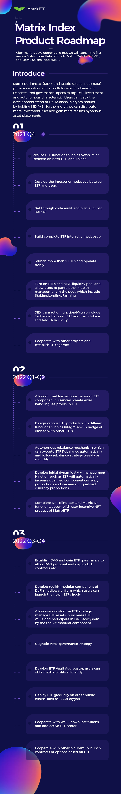

# Roadmap

**There are MatrixETF product roadmap as below:**

## 2021 Q4 

* Realize ETF functions such as Swap, Mint, Redeem on both ETH and Solana
* Develop the interaction webpage between ETF and users
* Get through code audit and official public testnet
* Build complete ETF interaction webpage
* Launch more than 2 ETFs and operate stably
* Turn on ETFs and MDF liquidity pool and allow users to participate in asset management in the pool, which include Staking/Lending/Farming
* DEX transaction function-Mswap,include Exchange between ETF and main tokens and Add LP liquidity
* Cooperate with other projects and establish LP together

## 2022 Q1-Q2 

* Allow mutual transactions between ETF component currencies, create extra handling fee profits to ETF
* Design various ETF products with different functions such as integrate with hedge or embed with other ETFs
* Autonomous rebalance mechanism which can execute ETF Rebalance automatically and follow rebalance strategy weekly or monthly
* Develop initial dynamic AMM management function such as ETF will automatically increase qualified component currency proportions and decrease unqualified currency proportions
* Complete NFT Blind Box and Matrix NFT functions, accomplish user incentive NFT product of MatrixETF

## 2022 Q3-Q4 

* Establish DAO and gain ETF governance to allow DAO proposal and deploy ETF contracts etc
* Develop toolkit modular component of DeFi middleware, from which users can launch their own ETFs freely
* Allow users customize ETF strategy, manage ETF assets to increase ETF value and participate in DeFi ecosystem by the toolkit modular component
* Upgrade AMM governance strategy
* Develop ETF Vault Aggregator, users can obtain extra profits efficiently
* Deploy ETF gradually on other public chains such as BSC/Polygon
* Cooperate with well-known institutions and add active ETF sector
* Cooperate with other platform to launch contracts or options based on ETF

The launching of 2 Matrix Index products will meet various investment demands of community users in crypto market. We will gradually iterate optimizing the products to meet encrypted ETF investment desires. Meanwhile we are on the process of User Incentive Proposal for MDI/MSI/MDF holders, which will be announced in the near future. Stay tuned with MatrixETF!
