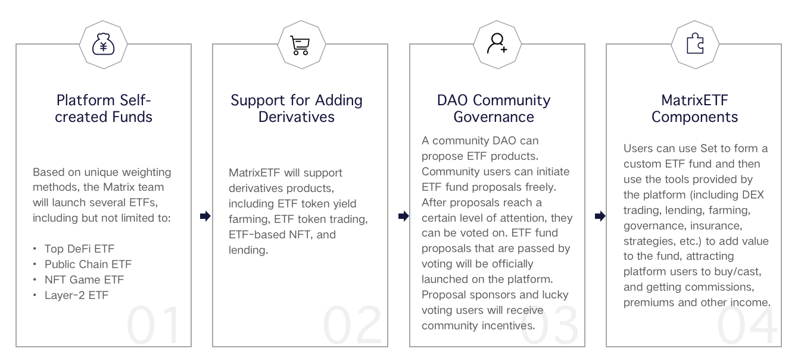

# Roadmap

**There are 4 phases on MatrixETF product roadmap as below:**

**Phase1：Platform Self-created Funds**

At this phase, MatrixETF will launch multiple conceptual ETFs based on unique weighting methods, including but not limited to:

•Top DeFi ETF

•Public Chain ETF

•NFT Game ETF

•Layer-2 ETF

Most ETF products on the MatrixETF platform are supported by a basket of encrypted assets, which can be purchased and redeemed at any time. Users can track the performance of high-quality tokens in specific areas of the blockchain through operations such as purchase transactions and redemption of ETF products, as well as achieve diversified investment goal.

**Phase2：Support for Adding Derivatives**

MatrixETF will put users’ assets on the platform to participate in the interaction with getting out of DeFi ecosystem, such as participating in Compound lending, Uniswap liquidity mining, etc. to generate aggregated Vault income, which will be returned to users who hold ETF funds, bringing additional benefits to users’ income.

Therefore, MatrixETF products at this phase will support derivatives, including EFT mining, ETF trading, ETF based NFT as well as lending.

**Phase3：DAO Community Governance**

In the early stage, the platform launched several main conceptual ETFs as the base, then gradually transitioned to the way of community autonomy to jointly determine to the construction and implementation of ETF products. In the end Matrix Dao will in charge of MatrixETF, as we know MatrixETF is a decentralized autonomous organization.

Users in community can initiate ETF product proposals through Dao, after the proposals reach a certain degree of attention, they can have a vote. ETF proposals which have been voted will be officially launched on the platform. Proposals sponsors and winner will receive the incentives by community.

**Phase4：MatrixETF Components**

At this stage, MatrixETF will open the MatrixETF Set toolkit. MatrixETF Set is an ETF-DeFi protocol which can provide convenient asset investment portfolio and transaction services for asset issuers/KOLs, asset managers and individuals. Through this agreement, any user could create a cryptocurrency ETF, accept user capital injections, at the same time use the tool provided by the platform\(including DEX trading, lending, farming, governance, insurance, strategy etc\) to operate the fund consequently to obtain benefits.

On this basis, all the users can use the Set component to customize ETF, then use different tools provided by the platform to add value in addition to attract more customers to purchase/cast, therefore to obtain commissions/premiums etc. As a unique and diversified toolkit, MatrixETF Set will provide more convenient products for special groups such as fund managers, KOLs and investment institutes, which is good for the accumulation of traffic and the expansion of the ETF market.

